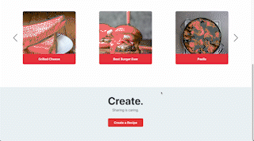

# Taste. 🍽

View and share your own recipes from anywhere - whether it's your phone or your computer. Recipes obtained from my [Taste Recipes API](https://github.com/arangotang/taste-recipes).

## See it in action 👀

### Home

The home page features an infinite carousel of user-submitted recipes and a link to start creating recipes.

### Create Recipes 🧑‍🍳

The "Create." page provides users with the flexibility to seamlessly add and remove ingredients and steps throughout the recipe creation process.

Once the form has been filled out, users can search for high-res images to accompany the recipe.

...voila! Your recipe is now ready for submission and immediate viewing!

### Mobile-Friendly Design 📱

All of the functionality above is also ready for use on your mobile browser

## Technologies Used

### Setup and Configuration

### Front End Development

### Back End Development (Used in the [Taste Recipes API](https://github.com/arangotang/taste-recipes))

### External API: [Unsplash](https://unsplash.com/developers)
